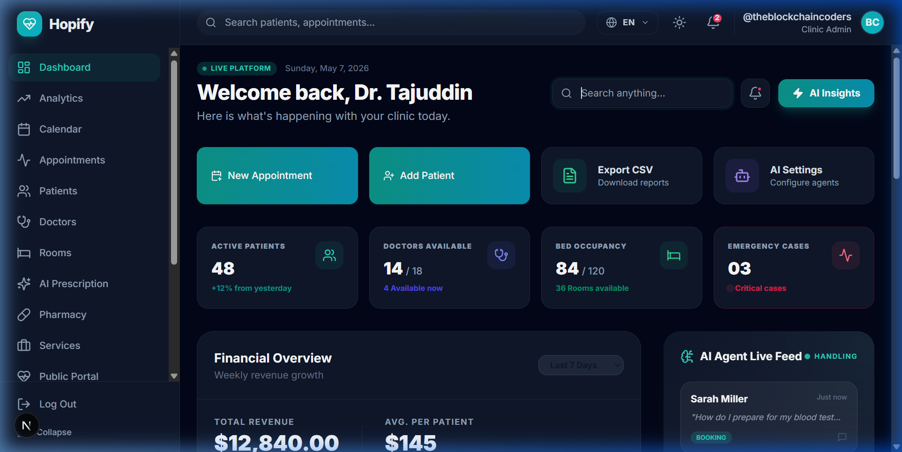
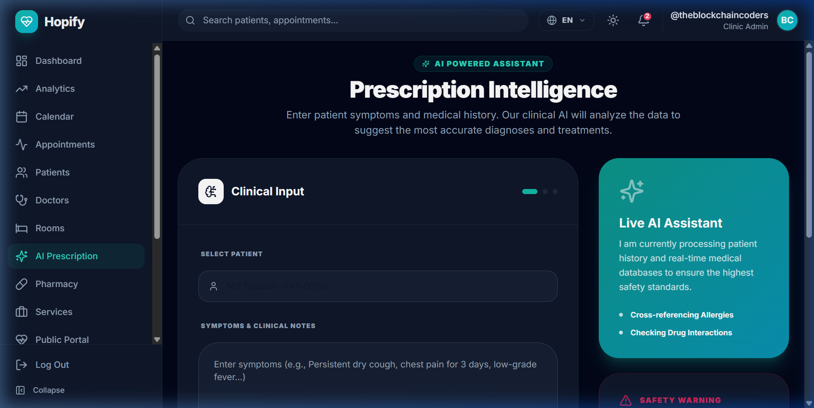
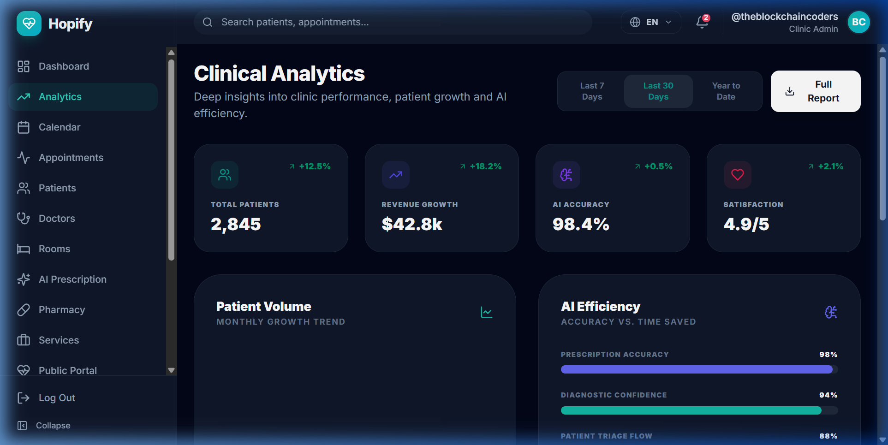
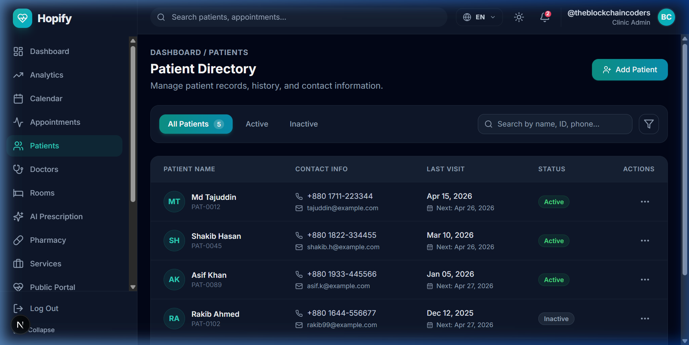

# Hopify 🏥 AI-Powered Clinic Management SaaS

Hopify is a high-fidelity, enterprise-grade clinic management platform designed to automate clinical workflows using advanced AI agents. Built with Next.js 15, Tailwind CSS, and Lucide Icons, it offers a seamless experience for doctors, staff, and patients.

## 🚀 Live Demo Visuals

### 📊 Modern Dashboard

*Real-time hospital status, patient metrics, and AI live feed monitoring.*

### 🧠 AI Prescription & Triage

*Advanced AI agents assisting doctors with diagnosis and treatment recommendations.*

### 📈 Clinical Analytics

*Deep operational insights, revenue growth tracking, and efficiency metrics.*

### 👥 Patient Management

*Comprehensive EMR system for tracking patient history and clinical records.*

---

## ✨ Key Features

- **AI Triage Agent**: Automated symptom analysis and patient prioritization.
- **AI Prescription Engine**: Safe, data-driven treatment suggestions.
- **Patient Portal**: Interactive portal for bookings and health records.
- **Analytics Hub**: 24/7 revenue and efficiency monitoring.
- **Hospital Capacity**: Real-time ward and bed occupancy tracking.
- **Security First**: HIPAA/GDPR compliant architecture with 256-bit encryption.

## 🛠️ Technology Stack

- **Framework**: [Next.js 15](https://nextjs.org/) (App Router)
- **Styling**: [Tailwind CSS](https://tailwindcss.com/)
- **Icons**: [Lucide React](https://lucide.dev/)
- **State Management**: React Context & Hooks
- **Internationalization**: Custom i18n system (EN/FR)
- **Theme**: Dark/Light mode support with `next-themes`

## 📦 Installation

```bash
# Clone the repository
git clone https://github.com/yourusername/hopify.git

# Install dependencies
npm install

# Run the development server
npm run dev
```

## 📄 License

This project is licensed under the MIT License - see the [LICENSE](LICENSE) file for details.

---

*Hopify - The Future of Healthcare Intelligence.*
